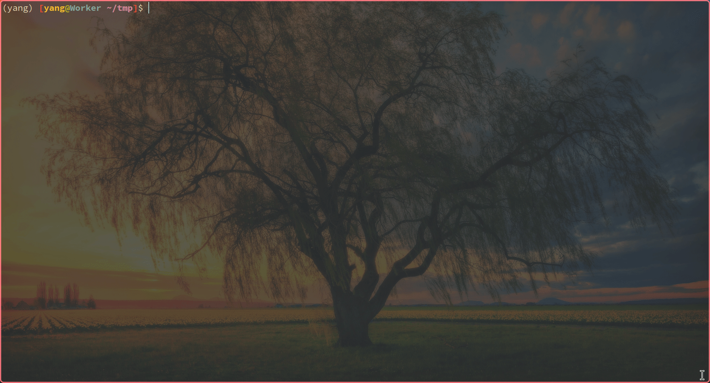

<div align="center">

yangdl: A **y**oung **an**d **g**racious pytorch-based framework for **d**eep **l**earning.

[](https://github.com/Lightning-AI/lightning/blob/master/LICENSE)

</div>

## Table of Contents

- [Introduction](#introduction)
- [Requirements](#requirements)
- [Install](#install)
- [Usage](#usage)
- [License](#license)

## Introduction

Currently, most pytorch-based frameworks (such as [pytorch-lightning](https://github.com/Lightning-AI/pytorch-lightning)) are too complex for most users.
Although this framework (`yangdl`) only has a few hundred lines of code, it can meet the basic needs of most scientific research and deep learning competitions.
The project structure of this framework is simple and the comments are complete.
It is very suitable for beginners to learn and for users to make customized modifications.

Main features:

1. Support `train`, `val`, `test` and `predict` stage.
2. Automatic aggregation of multi-fold results.
3. Various task metric (classification, segmentation, regression).
4. Progress bar for tracking experiment results.
5. Automatically record metrics in tensorboard.
6. Mixed precision.
7. Early stop.
8. Automatic experiment logging.
9. Flexibly save checkpoints.
10. Automatically save experiment code.

Demo:



Experiment results directory:

```txt
res/tmp
├── ckpt
│   ├── 1
│   │   └── best.pt
│   └── 2
│       └── best.pt
├── code.py
├── log
│   ├── 1
│   │   └── events.out.tfevents.1701581179.Worker.107305.0
│   ├── 2
│   │   └── events.out.tfevents.1701581189.Worker.107305.1
│   └── log.txt
├── metric
│   ├── early_stop.json
│   ├── test.json
│   ├── train.json
│   └── val.json
└── split
    ├── test
    │   ├── 1.csv
    │   └── 2.csv
    ├── train
    │   ├── 1.csv
    │   └── 2.csv
    └── val
        ├── 1.csv
        └── 2.csv
```

## Requirements

```txt
python>=3.10
```
and
```txt
numpy
scikit-learn
rich
tensorboard
torch
```

## Install

```bash
pip install yangdl
```
or
```bash
git clone https://github.com/m1dsolo/yangdl.git
cd yangdl
pip install -e .
```

## Usage

You just need to write your own ModelModule, DataModule and TaskModule!

```python
from torch import nn
from torch.nn import functional as F
from torch.optim import AdamW
from torch.utils.data import DataLoader

import yangdl as yd


yd.env.exp_path = './res/tmp'  # experiment results path
yd.env.seed = 1  # set seed for reproduction


# 1. Model
class MyModelModule(yd.ModelModule):
    def __init__(self):
        super().__init__()

        self.criterion = nn.CrossEntropyLoss()
        self.loss = yd.ValueMetric()
        # we have SegMetric for segmentation and RegMetric for regression
        self.metric = yd.ClsMetric(num_classes=5, properties=['acc', 'f1_score'])

    def __iter__(self):
        for fold in range(1, 6):
            self.model = YourModel(num_classes=5)  # replace with your model
            self.optimizer = AdamW(self.model.parameters(), lr=1e-4, weight_decay=1e-4)

            yield  # each fold will use a new model

    def train_step(self, batch):  # your 
        loss = self._step(batch)
        loss.backward()

        self.optimizer.step()
        self.optimizer.zero_grad()

        return {'loss': loss, 'acc': self.metric.acc}

    def val_step(self, batch):  # dont need gradient backpropagation
        loss = self._step(batch)

        return {'loss': loss, 'acc': self.metric.acc}  # will show on the progress bar

    def test_step(self, batch):  # same as val_step
        return self.val_step(batch)

    def train_epoch_end(self):  # call at the end of each epoch
        yd.logger.log_props(loss=self.loss.val, acc=self.metric.acc)  # log properties of metric

    def val_epoch_end(self):  # same as train_epoch_end
        return self.train_epoch_end()

    def test_epoch_end(self):  # same as train_epoch_end
        return self.train_epoch_end()

    def _step(self, x, y):  # train, val, test has the same forward propagation
        logits = self.model(x)

        probs = F.softmax(logits, dim=1)
        self.metric.update(probs, y)

        loss = self.criterion(logits, y)
        self.loss.update(loss, len(x))

        return loss


# 2. Data
class MyDataModule(yd.DataModule):
    def __init__(self):
        super().__init__()

    def train_loader(self):
        for fold in range(1, 6):
            dataset = YourDataset('train', fold)  # replace with your own dataset
            yield DataLoader(dataset, batch_size=16, shuffle=True, drop_last=True)  # yield DataLoader for each fold

    def val_loader(self):
        for fold in range(1, 6):
            dataset = YourDataset('val', fold)
            yield DataLoader(dataset, batch_size=1, shuffle=False, drop_last=False)

    def test_loader(self):
        for fold in range(1, 6):
            dataset = YourDataset('test', fold)
            yield DataLoader(dataset, batch_size=1, shuffle=False, drop_last=False)


# 3. Task
if __name__ == '__main__':
    model_module = MyModelModule()  # instantiate
    data_module = MyDataModule()
    task_module = yd.TaskModule(
        early_stop_params={
            'monitor': {'loss.val': 'small'},  # will save the model with the smallest loss
            'patience': 10,  # stop if the result doesn't improve for more than 10 epochs
            'min_stop_epoch': 10,
            'max_stop_epoch': 100,
        },
        model_module=model_module,
        data_module=data_module
    )
    task_module.do()  # begin your experiment!
```

You can refer to more examples in the [examples](./examples) directory!
Current examples are as follows:

1. [digit-recognizer](./examples/digit-recognizer.py): A simple implementation of kaggle competition [Digit Recognizer](https://www.kaggle.com/c/digit-recognizer).

## License

[MIT](LICENSE) © m1dsolo
